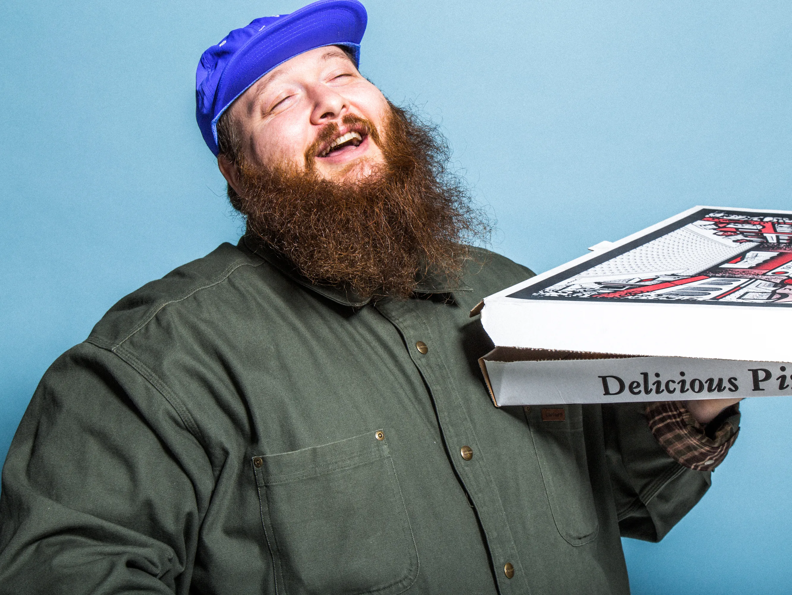

  

# Bronsoliño, _wtf are you saying?!_
In this project I attempt to decipher Action Bronson's rap formula and the themes he raps about the most in his tracks. My project references several other projects:
* **[youtube_dl](https://pypi.org/project/youtube_dl/)** to download several acapellas
* **[speech_recogntion](https://pypi.org/project/SpeechRecognition/)** to convert audio to text files
* tbd

## NLP methodology

TBD